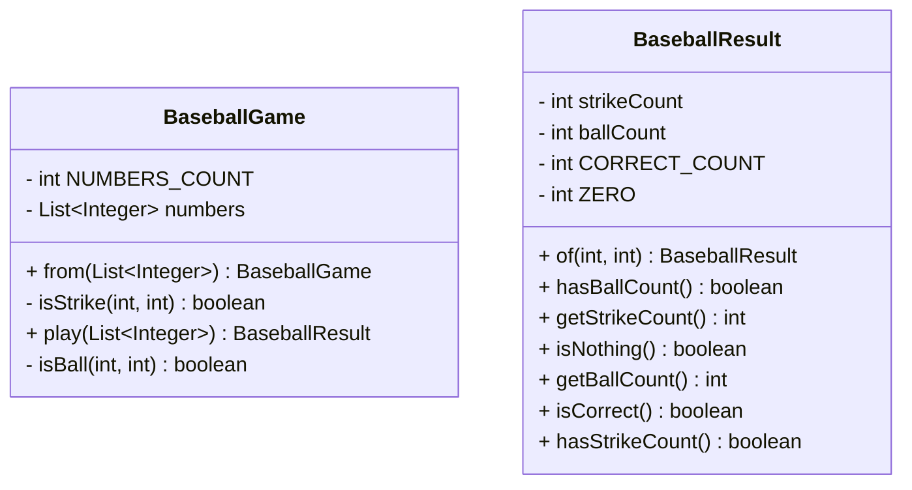

# java-baseball-6


## 프로젝트 소개

> 소개말
> 베이스볼 게임을 할 수 있는 자바 프로젝트입니다.  
> 컴퓨터가 만든 숫자를 사용자는 맞추는 형식으로 진행하며, 컴퓨터가 맞추는 서비스는 제공하지 않습니다.
### 기능 소개

1. 사용자는 컴퓨터가 만든 숫자 3개를 맞추는 형식으로 게임이 진행됩니다.
2. 다음의 규칙에 따라 힌트를 받을 수 있습니다.
   - N볼 : 사용자가 제공한 숫자 번호들에 N개의 정답 숫자가 포함되어 있지만, 자리가 일치하지 않습니다.
   - N스트라이크 : 사용자가 제공한 숫자 번호들에 N개의 정답 숫자가 포함되어있으며, 자리도 일치합니다.
   - 낫싱 : 사용자가 제공한 숫자들 중 어느것도 정답 번호에 포함되지 않습니다.
   - 3스트라이크 : 정답

---

### 기능 예제

**1.사용자의 숫자 입력**

- 사용자는 정답을 맞추기 위해 숫자를 입력할 수 있습니다.

```
숫자를 입력해주세요 : 123
```

**2. 정답에 대한 힌트 제공**
- 사용자의 입력값에 대하여 힌트를 제공받을 수 있습니다.
```
숫자를 입력해주세요 : 123
2볼
```

**3. 게임 재시작 혹은 종료**
- 사용자는 정답을 맞춘 후 게임을 재시작하거나 종료할 수 있습니다.
```
3스트라이크
3개의 숫자를 모두 맞히셨습니다! 게임 종료
게임을 새로 시작하려면 1, 종료하려면 2를 입력하세요.
```

### 입력 가이드

**1. 사용자의 숫자 입력**

- 입력은 3개의 숫자를 붙여서 입력합니다.
- 이 경우, 중복되는 숫자나 0 혹은 문자가 포함될 경우 게임이 종료됩니다.

```
숫자를 입력해주세요 : 123

숫자를 입력해주세요 : 456

숫자를 입력해주세요 : 789
```

**2. 사용자의 재시작 혹은 종료 입력**
- 이 입력은 1 혹은 2만 입력될 수 있습니다.
- 이 외의 경우 게임은 종료됩니다.
```
게임을 새로 시작하려면 1, 종료하려면 2를 입력하세요.
2

게임을 새로 시작하려면 1, 종료하려면 2를 입력하세요.
1
```

### 프로젝트 패키지 구조

**Class Diagram**



**트리 구조**

```
baseball
    ├── Application.java
    ├── component
    │   ├── BaseballGameGenerator.java
    │   ├── BaseballGameNumbersGenerator.java
    │   └── GameNumbersGenerator.java
    ├── config
    │   └── BaseballConfig.java
    ├── controller
    │   └── BaseballController.java
    ├── domain
    │   ├── BaseballGame.java
    │   └── BaseballResult.java
    ├── enums
    │   └── OutputMessage.java
    ├── handler
    │   └── RetryHandler.java
    └── view
        ├── InputParser.java
        ├── InputValidator.java
        ├── InputView.java
        └── OutputView.java
```


### 요구사항 명세

**입력**

- [x]  서로 다른 3자리의 수
   - [x]  숫자가 3자리 나오는지 검증
   - [x]  숫자에 중복이 없는지 검증
- [x]  게임이 끝난 경우 재시작/종료를 구분하는 1과 2 중 하나의 수
   - [x]  1 혹은 2가 입력되었는지 검증

**출력**

- [x]  입력한 수에 대한 결과를 볼, 스트라이크 개수로 표시

```
1볼 1스트라이크
```

- [x]  하나도 없는 경우

```
낫싱
```

- [x]  3개의 숫자를 모두 맞힐 경우

```
3스트라이크
3개의 숫자를 모두 맞히셨습니다! 게임 종료
```

- [x]  게임 시작 문구 출력

```
숫자 야구 게임을 시작합니다.
```

- [x]  숫자 입력 메시지 출력

```
숫자를 입력해주세요 : 
```

- [x]  게임 종료 메시지 출력

```
3개의 숫자를 모두 맞히셨습니다! 게임 종료
```

- [x]  게임 재시작 혹은 종료 메시지 출력

```
게임을 새로 시작하려면 1, 종료하려면 2를 입력하세요.
```

**실행 결과 예시**

```
숫자 야구 게임을 시작합니다.
숫자를 입력해주세요 : 123
1볼 1스트라이크
숫자를 입력해주세요 : 145
1볼
숫자를 입력해주세요 : 671
2볼
숫자를 입력해주세요 : 216
1스트라이크
숫자를 입력해주세요 : 713
3스트라이크
3개의 숫자를 모두 맞히셨습니다! 게임 종료
게임을 새로 시작하려면 1, 종료하려면 2를 입력하세요.
1
숫자를 입력해주세요 : 123
1볼
...
```

**기능**

- [x]  컴퓨터를 수를 선정하는 기능 (랜덤 수 뽑기)
- [x]  사용자의 수와 컴퓨터의 수를 비교한다.
    - [x]  같은 자리에 같은 수가 있는 경우
    - [x]  다른 자리에 같은 수가 있는 경우
    - [x]  사용자가 정답을 입력할 때까지, 반복 수행한다.
- [x]  정답을 입력한 경우, 게임을 재시작하거나 종료하는 기능
    - [x]  1이라면 재시작한다.
    - [x]  2라면 게임을 종료한다.
- [x]  사용자가 잘못된 값을 입력할 경우 `IllegalArgumentException`을 발생시킨 후 애플리케이션은 종료되어야 한다.

**로직 흐름**

1. 숫자 야구게임을 시작한다.
2. 컴퓨터를 위한 숫자를 뽑는다.
3. 사용자로부터 입력을 받는다.
    1. 같은 자리에 같은 수가 존재하는지 체크한다.
    2. 다른 자리에 같은 수가 존재하는지 체크한다.
4. 앞의 입력을 통해 사용자에게 힌트를 출력한다.
5. 사용자가 숫자를 맞출 때까지 반복한다.
6. 사용자가 숫자를 맞추면 다시 게임을 시작할지 종료할지를 1 혹은 2를 입력받는다.
7. 1이라면 1번으로 돌아가고 2번이라면 종료한다.